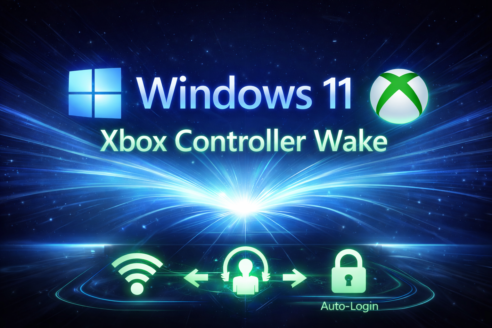

<p align="center">
  
</p>

# Console-Style PC Wizard  
**Turn Windows 11 into an Xbox-style console with controller wake, classic S3 sleep, and auto-login.**  
Created by **SoCal IT** — https://github.com/socalit  

---

## Why I Built This
Windows 11 continues stripping away options that made classic sleep work reliably:

- No clear “S3 Sleep” toggle  
- Modern Standby (S0ix) replacing true deep sleep  
- Login prompts when waking from sleep  
- Broken or inconsistent USB power management  
- Xbox controller wake not working reliably  

I built this project because I want my PC to behave **exactly like an Xbox console**:

- Press Xbox button → **PC wakes instantly**  
- No login screen  
- Instant sleep / instant-on behavior  
- Controller wake via the **official Xbox Wireless Adapter**
- No Modern Standby issues  

Microsoft removed many of these options from the UI — this wizard brings them back.

---

# Requirements

To enable console-style controller wake, you **must have**:

### **Xbox Wireless Adapter for Windows (USB dongle)**
Amazon affiliate link: https://amzn.to/4i0bjEW
(Not Bluetooth — Bluetooth cannot reliably wake a PC.)

### **Xbox One / Series X|S Wireless Controller**

### **Windows 10/11 PC with S3 Sleep enabled in BIOS**  
If S3 is missing, the script will explain how to enable it.

---

# Features

## 1. Console-Style Sleep Setup
- Enables or enforces **Classic S3 Sleep**  
- Disables **Modern Standby (S0ix)** via registry override  
- Applies console-style sleep & display timeouts  
- Enables **controller wake** using:
  - Name-based device scan  
  - USB VID/PID hardware scan for the wireless dongle  
- Gives BIOS instructions if S3 is disabled

## 2. Controller Wake
Configures your system so pressing **the Xbox button** wakes your PC — just like an Xbox console.

## 3. Auto Login (Console-Style Startup)
- Skips the Windows login screen  
- Uses Windows AutoAdminLogon  
- Disables **“Require sign-in on wake”**  
- Fully reversible

## 4. Full Revert Menu
Restore everything back to default Windows behavior:

- Remove S3 override  
- Re-enable Modern Standby  
- Re-enable password prompts  
- Restore timeouts  
- Disable controller wake  
- Disable auto-login settings  

## 5. Intelligent Xbox Wireless Adapter Detection
This wizard uses **two-layer detection**:

### **1. Name-based detection**
Finds:
- “Xbox Wireless Adapter for Windows”
- “Xbox Controller”
- “Xbox Wireless Controller”

### **2. Hardware VID/PID detection (official Microsoft adapters)**

| Adapter | VID | PID |
|--------|------|------|
| Xbox Wireless Adapter (Model 1790) | 045E | 02FE |
| Xbox Wireless Adapter (Model 1713) | 045E | 0B05 |
| Additional official revisions | 045E | 02E6 / 02F9 / 091E |

If the dongle isn’t detected, the script explains possible fixes.

---

# How to Use

### 1. Download the script  
`ConsoleStylePCWizard.cmd`

### 2. Right-click → **Run as administrator**

### 3. Choose an option:
```
[1] Full Setup (Sleep + Auto Login + Wake)
[2] Sleep Only
[3] Auto Login Only
[4] Revert Sleep Tweaks
[5] Disable Auto Login
```

### 4. If S3 is not enabled  
You’ll see:

> “S3 Sleep is not enabled in BIOS. Here is how to turn it on…”

The wizard provides detailed BIOS/UEFI instructions.

### 5. Follow the prompts  
Color-coded interface:

- Green   → Success  
- Red     → Errors / Warnings  
- White   → Info  
- Theme   → Green text on black background (console-style)  

---

# Security Notice (Plaintext Password)
If you enable Auto Login:

- Your password is stored as **plaintext** in the registry  
- This is Microsoft’s *built-in* AutoAdminLogon behavior  
- Only use this on a **personal gaming PC you fully control**

Do *not* use Auto Login on:
- Work PCs  
- Domain-joined systems  
- Shared computers  

---

# BIOS Requirements for S3 Sleep
If your PC does not support S3 sleep, the wizard explains how to enable it.

Common BIOS options:

- **ACPI Sleep State → S3**  
- **Legacy S3 Mode**  
- **Suspend Mode → S3 Only**  
- **Disable S0 Low Power Idle**  
- **Disable Modern Standby**  

Most desktop motherboards support S3.

Some OEM laptops may permanently remove S3 support.

---

# License
MIT License — free to use, modify, and redistribute.

---

# Support the Project
If this tool helped you:

### ⭐ **Star the GitHub repo**  
### 🕹 Share it with PC gaming communities  
### 🐛 Open issues or request features  

I built this because I wanted console behavior on Windows and I know many others want the too
